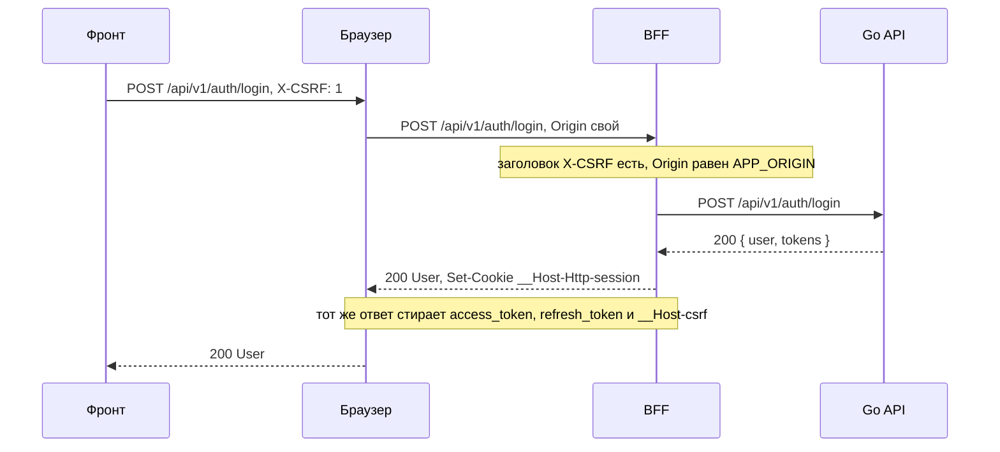
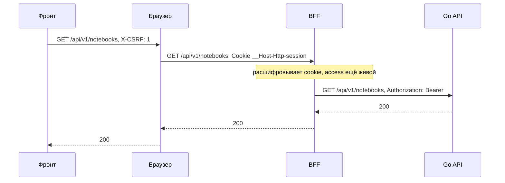
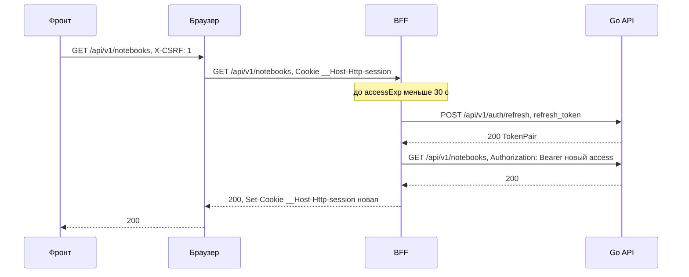
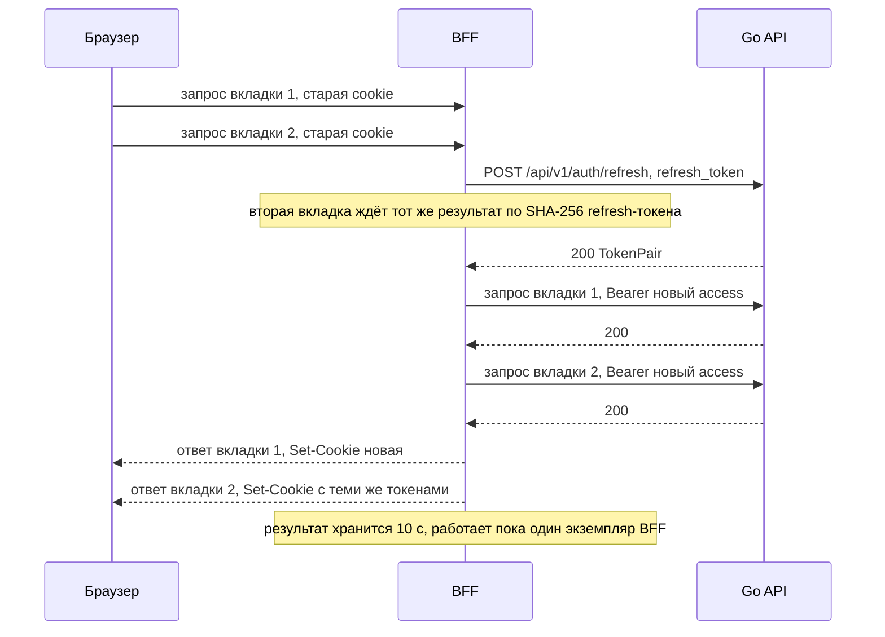
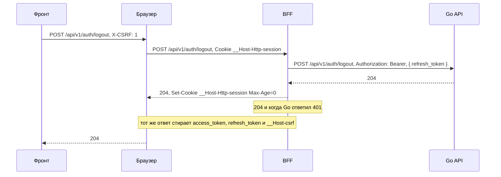
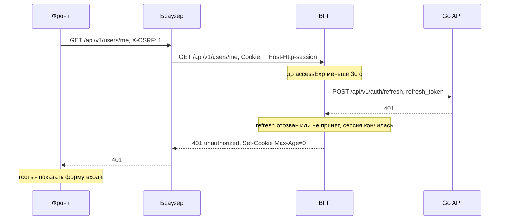
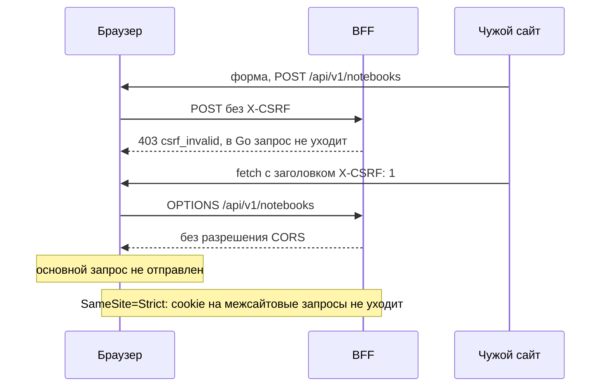
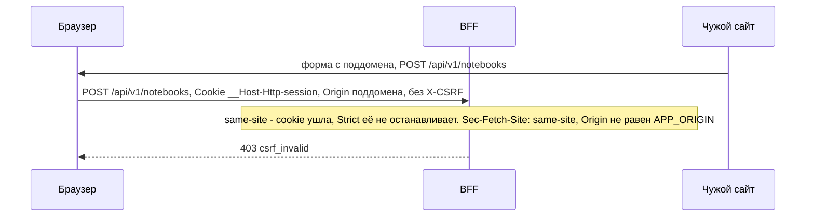
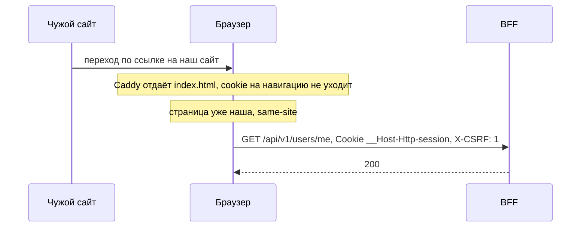
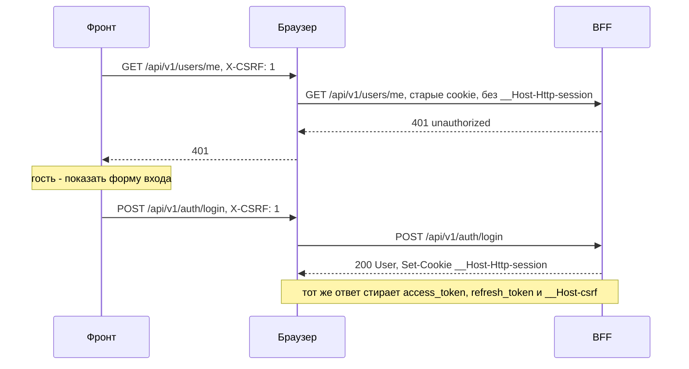

# Миграция на BFF: авторизация и CSRF

::: warning
Проект трека миграции на BFF, ещё не внедрено. Как работает сейчас — раздел [CSRF](/security/csrf/).
:::

Как BFF хранит сессию, обновляет токены и защищается от CSRF, а затем десять сценариев по шагам.
Общая картина — [«Обзор»](./), формат ручек — [«Контракт»](./contract). Как защита устроена сейчас —
в разделе [CSRF](/security/csrf/).

## Cookie сессии

BFF держит всю сессию в одной cookie `__Host-Http-session`. Токены Go API лежат внутри неё в
зашифрованном виде, а в браузер не попадает ничего, что JavaScript мог бы прочитать.

| Атрибут | Значение |
|---|---|
| Имя | `__Host-Http-session` |
| `HttpOnly` | да |
| `Secure` | да |
| `Path` | `/` |
| `SameSite` | `Strict` |
| `Domain` | не задаётся |
| `Max-Age` | `refresh_expires_in` из ответа Go |

Значение — `base64url(iv ‖ шифротекст ‖ тег)`: AES-256-GCM, ключ `SESSION_KEY` (32 байта), имя cookie
служит AAD (дополнительные аутентифицируемые данные). `iv` — 12 случайных байт из CSPRNG
(`crypto.getRandomValues`), новые при каждом шифровании; повтор IV с тем же `SESSION_KEY` ломает GCM.
Ошибка расшифровки или тега — `401 unauthorized`. Внутри — JSON:

```json
{ "access": "…", "refresh": "…", "accessExp": 1760000000, "refreshExp": 1762600000 }
```

*Пример формы; значения токенов и ключа на страницах не приводятся.*

Что говорит RFC 10017. Атрибуты и префикс
([§6.1.3.2](https://www.rfc-editor.org/rfc/rfc10017#section-6.1.3.2)):

> The BFF MUST enable the Secure flag for its cookies.

> The BFF MUST enable the HttpOnly flag for its cookies.

> The BFF SHOULD enable the SameSite=Strict flag for its cookies.

> The BFF SHOULD start the name of its cookie with a prefix indicating the cookie was set via HTTP, for example, by using the __Host-Http- prefix defined in [COOKIES].

Шифрование там же:

> the BFF SHOULD encrypt its cookie contents.

Сессия в самой cookie допустима
([§6.1.2.3](https://www.rfc-editor.org/rfc/rfc10017#section-6.1.2.3)): раз cookie нужна только для
получения токенов, управление и отзыв следуют из access и refresh.

> It suffices to revoke the user's access token and/or refresh token to prevent ongoing access to protected resources, without the need to explicitly invalidate the cookie-based session.

Почему не Redis и не память процесса: BFF остаётся без состояния. Деплой на каждый коммит `main`
никого не разлогинивает, новых сервисов не появляется. Цена: смена `SESSION_KEY` разлогинивает всех.

## Как BFF проксирует запрос

Порядок проверок один для всех запросов к `/api/v1`, включая `login`, `register` и `logout`:

1. Проверки CSRF (раздел «CSRF» ниже). Не прошли — `403 csrf_invalid`, в Go ничего не уходит.
2. Маршрута нет в списке разрешённых, то есть в публичном контракте ([«Контракт»](./contract#какие-запросы-bff-пропускает)), —
   `404 not_found`. Маршруты с тегом `bff` обслуживают хендлеры BFF, а не прокси
   ([«Собственные ручки BFF»](./contract#собственные-ручки-bff)).
3. Дальше только для ручек с `sessionCookie` (см. [«Контракт»](./contract)): cookie нет или она не
   расшифровывается — `401 unauthorized`.
4. Если до `accessExp` меньше 30 с, обновить токены через refresh до запроса.
5. Отправить запрос в Go (`http://api:8080/api/v1`) с `Authorization: Bearer`. На двух VPS к нему
   добавляется `X-BFF-Key`, см. [«Две VPS»](/bff/#две-vps).
6. Если Go ответил `401`, обновить токены и повторить запрос один раз.
7. Ответить клиенту; если токены сменились, ответ несёт новую cookie.

Исключение — `logout`: после проверок CSRF и списка он всегда отвечает `204`. Без cookie сессии Go не
вызывается; cookie сессии и три старые cookie (`access_token` с `Path=/api/v1`, `refresh_token` с
`Path=/api/v1/auth`, `__Host-csrf` с `Path=/`) стираются в любом случае.

В Go уходят только `Content-Type`, `Accept`, `X-Request-ID` и тело. `Cookie` и `X-CSRF` не уходят.
`Set-Cookie` из ответа Go клиенту не пропускается: cookie выставляет только BFF.

Одновременные refresh объединяются. Ключ — SHA-256 refresh-токена, результат держится в памяти
10 с: вторая вкладка со старой cookie получает те же новые токены. Если Go отвергает refresh
(`401`), BFF стирает cookie (`Max-Age=0`) и отвечает `401 unauthorized`.

## CSRF

Три правила, все на стороне BFF. Проверки идут первыми, раньше списка разрешённых маршрутов и расшифровки
cookie, и для каждого запроса, включая вход, регистрацию и выход:

1. Каждый запрос к `/api/v1` без `X-CSRF: 1` получает `403 csrf_invalid` и в Go не уходит. Чужой
   origin не может поставить такой заголовок без preflight, а CORS BFF не разрешает никому: клиент
   живёт на том же origin.
2. Для `POST`, `PUT`, `PATCH`, `DELETE`: `Origin` равен `APP_ORIGIN`, а `Sec-Fetch-Site`, если он
   есть, равен `same-origin`; иначе `403 csrf_invalid`.
3. `SameSite=Strict`: cookie не уходит на межсайтовые запросы. SPA это не мешает: HTML отдаётся без
   cookie, а запросы к API делает страница того же сайта.

Первое правило — прямой путь из RFC
([§6.1.3.3.2](https://www.rfc-editor.org/rfc/rfc10017#section-6.1.3.3.2)):

> When this mechanism is used, the BFF MUST ensure that every incoming request carries this static header.

Подписанный Double Submit, как в нынешней реализации, RFC не ставит выше
([§6.1.3.3.3](https://www.rfc-editor.org/rfc/rfc10017#section-6.1.3.3.3)):

> Note that this mechanism is not necessarily recommended over the CORS approach.

WebSocket (будущая потоковая отдача вывода рантайма) CORS не знает: браузер сам прикладывает cookie к
рукопожатию с любого сайта, и это Cross-Site WebSocket Hijacking. Поэтому BFF проверяет `Origin` на
upgrade-запросе так же, как на мутациях: не равен `APP_ORIGIN` — `403`.

Фронту больше не нужно читать cookie, повторять запрос после `403` и обновлять токены на `401`:
`401` означает гостя и форму входа.

## Сценарии

Участники: `F` — код фронта, `B` — браузер, `P` — BFF, `A` — Go API, `E` — чужой сайт.

### Вход

Фронт шлёт логин с заголовком `X-CSRF: 1`. BFF проверяет заголовок и `Origin`, вызывает Go и
получает токены в JSON. Токены остаются в BFF: браузеру уходят `User` и новая cookie, а три старые
cookie стираются.



*Проект: проверить после внедрения.*

### Запрос данных

BFF расшифровывает cookie и подставляет access токен как `Authorization: Bearer`. Фронт про токены
ничего не знает.



*Проект: проверить после внедрения.*

### Access истёк

Если до `accessExp` меньше 30 с, BFF обновляет токены сам, а потом выполняет исходный запрос.
Фронт делает один запрос и не замечает refresh; новая cookie приходит с обычным ответом.



*Проект: проверить после внедрения.*

### Две вкладки

Две вкладки одновременно приходят со старой cookie, у которой access почти истёк. Refresh
объединяется: Go получает один вызов, обе вкладки получают одни и те же новые токены.



*Проект: проверить после внедрения.*

### Выход

После проверок CSRF и списка маршрутов BFF вызывает Go с Bearer и `refresh_token` в теле, стирает cookie
и отвечает `204`. Даже если Go вернул `401` (токен уже недействителен), клиент получает `204`: сессии
больше нет в любом случае. Без cookie сессии Go не вызывается, а ответ тот же `204`; три старые cookie
стираются всегда.



*Проект: проверить после внедрения.*

### Сессия кончилась

Refresh-токен отозван или не принят Go. Go отвечает `401`, BFF стирает cookie и отвечает
`401 unauthorized`; фронт показывает форму входа. Если refresh просто истёк, браузер уже удалил
cookie (`Max-Age` = `refresh_expires_in`), и BFF отвечает `401` на шаге проверки cookie, не обращаясь в Go.



*Проект: проверить после внедрения.*

### Атака с чужого сайта

Форма с чужого сайта не может поставить `X-CSRF`, поэтому получает `403 csrf_invalid`, а в Go
запрос не уходит. `fetch` с заголовком требует preflight, а BFF не разрешает CORS никому, так что
браузер не отправит основной запрос.



*Проект: проверить после внедрения.*

### Запрос с поддомена

Поддомен (скажем, захваченный) находится на том же сайте, поэтому `SameSite=Strict` не помогает:
cookie уходит вместе с запросом. Это именно тот случай, который `SameSite` один не закрывает
([§6.1.3.3.1](https://www.rfc-editor.org/rfc/rfc10017#section-6.1.3.3.1)):

> As a result, a subdomain-takeover attack against b.example.com can enable CSRF attacks against the BFF of a.example.com.

Форма с поддомена не может поставить `X-CSRF`, так что запрос отклоняется уже по отсутствию
заголовка. Проверка `Origin` и `Sec-Fetch-Site` — вторая линия: она сработала бы и при ошибке в
проверке заголовка или в настройке CORS.



*Проект: проверить после внедрения.*

### Переход по внешней ссылке

Пользователь переходит на сайт по ссылке с чужого сайта. Cookie `Strict` на такую навигацию не
уходит, и Caddy отдаёт `index.html` без неё. Дальше запросы к API делает уже страница нашего сайта, и
cookie с ними идёт.



*Проект: проверить после внедрения.*

### Первый вход после переезда

У пользователя в браузере старые cookie `access_token`, `refresh_token` и `__Host-csrf`, а новой
`__Host-Http-session` нет. Первый же запрос получает `401`, пользователь входит заново, и ответ
входа ставит новую cookie и стирает три старые.



*Проект: проверить после внедрения.*
