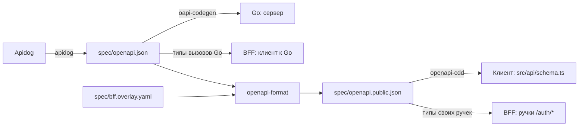

# Миграция на BFF: контракт

::: warning
Проект трека миграции на BFF, ещё не внедрено. Как работает сейчас — раздел [CSRF](/security/csrf/).
:::

Контракт API остаётся spec-first: в Apidog ведётся один контракт Go API, а публичный контракт BFF,
между клиентом и BFF, выводится из него отдельным файлом — overlay. Ручки данных описываются один раз,
а отличается только `/auth/*` и схема безопасности.

## Один источник



Почему не два контракта в Apidog: ручки данных (`/users/me`, `/notebooks*`) пришлось бы описывать
дважды и следить, чтобы описания не разошлись. Overlay хранит только различия.

## Что меняется в контракте Go

Go становится серверным API для BFF, поэтому его контракт в Apidog меняется:

- `TokenPair`: `access_token`, `access_expires_in` (секунды), `refresh_token`, `refresh_expires_in`
  (секунды);
- `/auth/register` → `201 { user: User, tokens: TokenPair }`, `/auth/login` → `200` того же вида;
- `/auth/refresh`: тело `{ refresh_token }` → `200 TokenPair`;
- `/auth/logout`: тело `{ refresh_token }`, `bearerAuth` → `204`;
- у ручек данных остаётся `bearerAuth`; `Set-Cookie`, параметр cookie `refresh_token` и заголовок
  `X-CSRF-Token` уходят.

Контракт уже требует `bearerAuth` у ручек данных, а бэк читает access только из cookie
[`access_token`](https://github.com/go-park-mail-ru/2026_2_Cringe_Driven_Development/blob/4094350/internal/middleware/authenticate.go#L19),
заголовок `Authorization` он не смотрит. После переезда код и контракт сходятся.

## Overlay

Публичный контракт получается из `spec/openapi.json` действиями
[OpenAPI Overlay](https://spec.openapis.org/overlay/v1.0.0.html) 1.0.0 из `spec/bff.overlay.yaml`:

- удаляется `/auth/refresh`: refresh делает сам BFF (см. сценарий [«Access истёк»](/bff/auth#access-истек));
- `/auth/register` и `/auth/login` отвечают схемой `User` и заголовком `Set-Cookie`;
- `/auth/logout` без тела запроса, отвечает `204` и `Set-Cookie`;
- `bearerAuth` заменяется схемами `sessionCookie` и `csrfHeader`: ручкам данных и `logout` нужны обе,
  `register` и `login` только `csrfHeader`;
- у ручек данных появляются ответы `401` и `403` со схемой `Error`.

```yaml
overlay: 1.0.0
info:
  title: Публичный контракт BFF
  version: 1.0.0
extends: openapi.json
actions:
  # /auth/refresh делает сам BFF, наружу его не отдаём
  - target: $.paths['/auth/refresh']
    remove: true

  # register и login: наружу отдаётся только User, токены остаются на сервере
  - target: $.paths['/auth/register'].post.responses['201']
    update:
      content:
        application/json:
          schema:
            $ref: '#/components/schemas/User'
      headers:
        Set-Cookie:
          schema:
            type: string
  - target: $.paths['/auth/login'].post.responses['200']
    update:
      content:
        application/json:
          schema:
            $ref: '#/components/schemas/User'
      headers:
        Set-Cookie:
          schema:
            type: string

  # logout: без тела запроса, 204 и Set-Cookie, который стирает сессию
  - target: $.paths['/auth/logout'].post.requestBody
    remove: true
  - target: $.paths['/auth/logout'].post.responses['204']
    update:
      headers:
        Set-Cookie:
          schema:
            type: string

  # схемы безопасности
  - target: $.components.securitySchemes.bearerAuth
    remove: true
  - target: $.components.securitySchemes
    update:
      sessionCookie:
        type: apiKey
        in: cookie
        name: __Host-Http-session
      csrfHeader:
        type: apiKey
        in: header
        name: X-CSRF

  # security: register и login — csrfHeader; данные и logout — оба
  - target: $.paths['/auth/register'].post
    update:
      security:
        - csrfHeader: []
  - target: $.paths['/auth/login'].post
    update:
      security:
        - csrfHeader: []
  - target: $.paths['/auth/logout'].post.security
    remove: true
  - target: $.paths['/auth/logout'].post
    update:
      security:
        - sessionCookie: []
          csrfHeader: []
  - target: $.paths['/users/me'].get.security
    remove: true
  - target: $.paths['/users/me'].get
    update:
      security:
        - sessionCookie: []
          csrfHeader: []
  # ... то же для остальных ручек данных: /notebooks*, /notebooks/{id}/cells*

  # 401 и 403 со схемой Error у ручек данных
  - target: $.paths['/users/me'].get.responses
    update:
      '401':
        description: Нет сессии
        content:
          application/json:
            schema:
              $ref: '#/components/schemas/Error'
      '403':
        description: Не прошла проверка CSRF
        content:
          application/json:
            schema:
              $ref: '#/components/schemas/Error'
```

Пример; точные пути зависят от выгрузки Apidog.

## Команды

`bun run sync` выполняет три шага подряд:

1. `apidog` выгружает контракт из Apidog в `spec/openapi.json`;
2. `overlay` выводит публичный контракт:

   ```sh
   openapi-format spec/openapi.json --overlayFile spec/bff.overlay.yaml -o spec/openapi.public.json
   ```

3. `generate` строит типы командой `openapi-cdd`: `apps/client` читает `spec/openapi.public.json`,
   `apps/bff` берёт `paths` обоих файлов, публичные для своих ручек `/auth/*` и внутренние для вызовов Go.

Файлы: `spec/openapi.json` создаёт `apidog`, `spec/bff.overlay.yaml` пишется руками,
`spec/openapi.public.json` создаёт `overlay` и коммитится в репозиторий.

## Проверки в CI

1. Каждое действие overlay находит хотя бы один узел. Без этого правка в Apidog (переименованный путь,
   удалённый ответ) молча ломает overlay: действие ничего не меняет, а публичный контракт расходится с
   задуманным.
2. `spec/openapi.public.json` совпадает с выведенным заново из `spec/openapi.json` и
   `spec/bff.overlay.yaml`.

## Какие запросы BFF пропускает

BFF проксирует только то, что есть в публичном контракте. Список разрешённых маршрутов строится из пар
«шаблон пути + метод»; параметры пути подставляются только в шаблон. Это требование
[RFC 10017 §6.1.3.6](https://www.rfc-editor.org/rfc/rfc10017#section-6.1.3.6):

> When implementing a dynamically configurable proxy, the BFF MUST ensure that it only allows requests to explicitly permitted hosts and paths.

Всё, чего нет в контракте, получает `404 not_found` без запроса в Go. Например, в контракте нет
`DELETE /api/v1/notebooks/{id}` (есть только `GET`), поэтому:

```http
DELETE /api/v1/notebooks/42

404 Not Found
{ "code": "not_found", "message": "..." }
```

Пример; в Go такой запрос не уходит.
