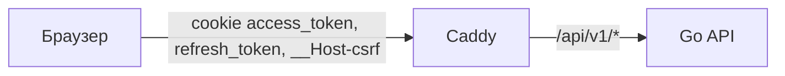
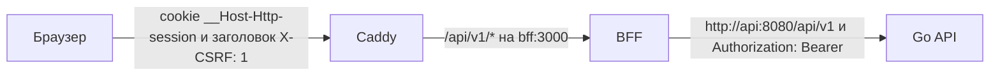
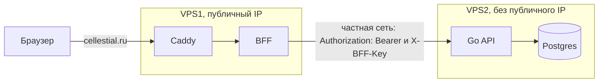

# Миграция на BFF: обзор

::: warning
Проект трека миграции на BFF, ещё не внедрено. Как работает сейчас — раздел [CSRF](/security/csrf/).
:::

Браузер ходит только в BFF (Backend for Frontend), а BFF проксирует запросы в Go API. Токены остаются
на сервере и в браузер не попадают: у пользователя только зашифрованная cookie сессии. Раздел
описывает целевое состояние трека; остальные страницы — [Контракт](/bff/contract) (как spec-first через Apidog
работает с BFF между клиентом и Go) и [Авторизация и CSRF](/bff/auth) (сессия, refresh и
защита от CSRF по сценариям).

## Было и стало

Сейчас токены кладёт в cookie сам Go API, а браузер получает их напрямую:

После переезда между Caddy и Go появляется BFF:

Клиент по-прежнему ходит на `/api/v1`: пути не меняются, а схемы данных остаются теми же. Текущая
маршрутизация — в
[`Caddyfile.j2`](https://github.com/Cringe-Driven-Development-Team/infra/blob/2f97437/ansible/roles/caddy/templates/Caddyfile.j2#L7)
(`reverse_proxy api:8080`); `api` не публикует порты и виден только из сети `app` — см.
[`compose.yml.j2`](https://github.com/Cringe-Driven-Development-Team/infra/blob/2f97437/ansible/roles/app/templates/compose.yml.j2#L18).

## Cookie до и после

| Cookie | `Path` | `HttpOnly` | `SameSite` | Кто читает |
|---|---|---|---|---|
| `access_token` (сейчас) | `/api/v1` | да | `Lax` | Go API |
| `refresh_token` (сейчас) | `/api/v1/auth` | да | `Lax` | Go API |
| `__Host-csrf` (сейчас) | `/` | **нет** | `Lax` | фронт читает из `document.cookie`, Go сверяет |
| `__Host-Http-session` (после) | `/` | да | `Strict` | только BFF; в браузере JavaScript её не видит |

Подробности про нынешние cookie — в разделе [CSRF](/security/csrf/). `__Host-Http-session` —
`Secure`, без `Domain`, срок `Max-Age` равен `refresh_expires_in`.

## Почему BFF

RFC 10017 «OAuth 2.0 for Browser-Based Applications» (BCP 212) перечисляет архитектуры браузерных
приложений ([§6](https://www.rfc-editor.org/rfc/rfc10017#section-6)) и ставит BFF первой:

> The patterns in this section are presented in decreasing order of security.

Про BFF отдельно
([§6.1.4.3](https://www.rfc-editor.org/rfc/rfc10017#section-6.1.4.3)):

> This architecture is strongly recommended for business applications, sensitive applications, and applications that handle personal data.

У нас личные данные пользователей, так что рекомендация подходит. Практический выигрыш: access и
refresh не доходят до браузера, а значит, XSS на странице не может их украсть. Но XSS всё равно может
слать запросы через BFF от имени пользователя: это сценарий «Proxying Requests via the User's Browser»
в [RFC 10017 §6.1.4.1](https://www.rfc-editor.org/rfc/rfc10017#section-6.1.4.1). BFF убирает кражу
токенов, но не последствия XSS.

## Что меняется

### Фронт

Клиент создаётся в
[`src/api/client.ts`](https://github.com/frontend-park-mail-ru/2026_2_Cringe_Driven_Development/blob/344ad0b/src/api/client.ts#L29)
с `baseUrl: '/api/v1'` и `credentials: 'include'`. Меняется middleware: `csrf.ts` больше не читает
cookie и ставит `X-CSRF: 1`; refresh на `401` и повтор после `403` уходят; `401` означает гостя и
форму входа; старт приложения — `GET /users/me`. Типы и fetch-клиент генерирует Orval из публичного
контракта. Задача frontend#34 становится не нужна.

### BFF

Новый сервис: проксирует `/api/v1/*` в Go, хранит сессию в зашифрованной cookie, обновляет access сам,
проверяет `X-CSRF`, `Origin` и `Sec-Fetch-Site`. Свои ручки (`/auth/*`, тег `bff`) — заготовки хендлеров Hono с zod-валидацией входа и ответа,
которые генерирует Orval; вызовы Go — сгенерированный Orval fetch-клиент. Работает без своего хранилища. Гонка backend#12
решается внутри BFF, пока он один экземпляр — см. сценарий [«Две вкладки»](/bff/auth#две-вкладки).

### Go API

`Authenticate` сейчас читает access из cookie
[`access_token`](https://github.com/go-park-mail-ru/2026_2_Cringe_Driven_Development/blob/4094350/internal/middleware/authenticate.go#L19),
хотя контракт уже говорит про `Authorization: Bearer`. После переезда он читает `Authorization: Bearer`,
токены отдаются в JSON, а middleware CSRF и CORS, код cookie и переменные `CSRF_SECRET`,
`COOKIE_SECURE`, `CORS_ALLOWED_ORIGINS` удаляются.

### Infra

В compose появляется сервис `bff` с `SESSION_KEY` и `APP_ORIGIN`, а Caddy направляет `/api/v1/*` на
`bff:3000`.

## Переключение

Go, BFF и Caddy выкатываются одним прогоном playbook, сразу после него промоутится релиз клиента.
Пока клиент не промоутнут, старый клиент получает `401` и `403`: это окно длится столько, сколько
проходит между двумя шагами. Ответы BFF на `login`, `register` и `logout` стирают три старые cookie с их
`Path`: `access_token` (`/api/v1`), `refresh_token` (`/api/v1/auth`) и `__Host-csrf` (`/`). Каждый
пользователь один раз входит заново — см. сценарий
[«Первый вход после переезда»](/bff/auth#первыи-вход-после-переезда).

## Две VPS

Целевая схема для двух машин. Сейчас стек Pulumi — одна VPS, а двухсерверная схема (gateway и backend)
заморожена в варианте `bff` документации
([`pulumi/README.md`](https://github.com/Cringe-Driven-Development-Team/infra/blob/2f97437/pulumi/README.md#L8)).

- **VPS1:** Caddy и BFF, публичный (floating) IP, домен `cellestial.ru`. **VPS2:** Go API и Postgres, без
  публичного IP, доступна только через частную сеть Selectel.
- **Домен один.** Публичного `api.cellestial.ru` нет: по схеме BFF браузер говорит только с BFF, а
  приложение живёт на одном origin с ним. RFC 10017
  ([§6.1.3.3.2](https://www.rfc-editor.org/rfc/rfc10017#section-6.1.3.3.2)) прямо допускает такую схему:

  > It is also possible to deploy the browser-based application on the same origin as the BFF.

  Отдельный публичный `api.*` нужен только другим клиентам, например мобильному приложению или
  партнёрам, и для них это `Authorization: Bearer` или OAuth, а не cookie.
- **BFF → Go** идёт на приватный адрес VPS2. Файрвол VPS2 (security group) пускает порт API только с
  VPS1.
- **S2S-ключ.** BFF шлёт заголовок `X-BFF-Key: <BFF_API_KEY>`, Go сравнивает значение за постоянное
  время; без ключа или с неверным — `401`. `BFF_API_KEY` лежит в `.env` обеих машин. Сильнее —
  mTLS между VPS1 и VPS2.
- **Без TLS внутри частной сети** — принятый риск MVP: Selectel изолирует приватную сеть. mTLS его бы
  закрыл.
- **Ansible** ходит на VPS2 по SSH только через VPS1 как jump host (`ProxyJump`): публичного адреса у
  VPS2 нет. Динамический inventory группирует хосты по `metadata.role`
  ([`openstack.yml`](https://github.com/Cringe-Driven-Development-Team/infra/blob/2f97437/ansible/inventory/openstack.yml#L17)),
  так что у второй машины будет своя роль.
- **Уже есть в Pulumi:** `private-network`, `private-subnet` и `router`
  ([`index.ts`](https://github.com/Cringe-Driven-Development-Team/infra/blob/2f97437/pulumi/index.ts#L182-L192)),
  инстанс `gateway` на порту частной подсети с floating IP
  ([`index.ts`](https://github.com/Cringe-Driven-Development-Team/infra/blob/2f97437/pulumi/index.ts#L250-L280)).
  Ресурсы backend-сервера удалены, и возвращать их под прежним именем нельзя до проверки стейта
  ([`README`](https://github.com/Cringe-Driven-Development-Team/infra/blob/2f97437/pulumi/README.md#L287)).

## Ограничения

- BFF работает одним экземпляром: объединение одновременных refresh держится в его памяти.
- Смена `SESSION_KEY` разлогинивает всех: старые cookie больше не расшифровываются.
- На одной VPS Go API закрыт только сетью compose, без S2S-ключа: из этой сети любой сервис может
  позвать его напрямую. На двух VPS есть ключ `X-BFF-Key` и файрвол, см. [«Две VPS»](#две-vps).
- BFF остаётся одним экземпляром. Второй экземпляр потребует общую блокировку refresh (Redis) или
  льготное окно из [backend#12](https://github.com/Cringe-Driven-Development-Team/backend/issues/12).
