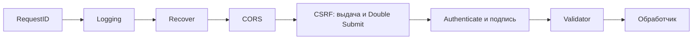

# CSRF: как устроено

Как сервис [cellestial.ru](https://cellestial.ru) защищается от CSRF: какие cookie выдаёт бэк,
что и где проверяется, что делает фронт. Код — на коммитах бэка
[`4094350`](https://github.com/go-park-mail-ru/2026_2_Cringe_Driven_Development/tree/4094350) и фронта
[`344ad0b`](https://github.com/frontend-park-mail-ru/2026_2_Cringe_Driven_Development/tree/344ad0b).
Как это выглядит в каждом случае — [«Сценарии»](./scenarios), что проверено и чего не хватает —
[«Проверка и ограничения»](./checks).

Схема защиты — Double Submit Cookie с подписью: сервер кладёт токен в cookie, которую JavaScript
нашего сайта может прочитать, а фронт повторяет его значение в заголовке `X-CSRF-Token`. Чужая
страница не может ни прочитать эту cookie, ни поставить заголовок, поэтому подделанный запрос
приходит без верного заголовка и получает `403`.

## Три cookie

| Cookie | `Path` | Срок | `HttpOnly` | `Secure` | `SameSite` | Кто ставит |
|---|---|---|---|---|---|---|
| `access_token` | `/api/v1` | 15 минут (`ACCESS_TOKEN_TTL`) | да | да на проде (`COOKIE_SECURE`) | `Lax` | login, register, refresh |
| `refresh_token` | `/api/v1/auth` | до конца refresh-сессии, 30 дней (`REFRESH_TOKEN_TTL`) | да | да на проде (`COOKIE_SECURE`) | `Lax` | login, register, refresh |
| `__Host-csrf` | `/` | 30 дней (`REFRESH_TOKEN_TTL`) | **нет** | всегда | `Lax` | login, register, refresh, logout и middleware |

- Access и refresh фронт не видит: `HttpOnly`. Код —
  [`tokenCookie`](https://github.com/go-park-mail-ru/2026_2_Cringe_Driven_Development/blob/4094350/internal/user/delivery/user.go#L135),
  пути — [`app.go`](https://github.com/go-park-mail-ru/2026_2_Cringe_Driven_Development/blob/4094350/internal/app/app.go#L97).
- `__Host-csrf` фронт читает из `document.cookie`, поэтому без `HttpOnly`. Префикс `__Host-`
  требует `Secure`, `Path=/` и запрещает `Domain`: поддомен не подложит свою cookie с этим
  именем. Код — [`CSRF.Cookie`](https://github.com/go-park-mail-ru/2026_2_Cringe_Driven_Development/blob/4094350/internal/auth/csrf.go#L55).
- Login, register и refresh ставят все три cookie и подписанный CSRF-токен
  ([`sessionCookies`](https://github.com/go-park-mail-ru/2026_2_Cringe_Driven_Development/blob/4094350/internal/user/delivery/user.go#L127)).
  Logout стирает access и refresh и ставит новый анонимный CSRF-токен
  ([`LogoutUser`](https://github.com/go-park-mail-ru/2026_2_Cringe_Driven_Development/blob/4094350/internal/user/delivery/user.go#L86)).

## Когда приходит `__Host-csrf`

Отдельной ручки за токеном нет. Middleware
[`CSRF`](https://github.com/go-park-mail-ru/2026_2_Cringe_Driven_Development/blob/4094350/internal/middleware/csrf.go#L22)
добавляет cookie к ответу любой ручки `/api/v1` (кроме `OPTIONS`), если в запросе её нет, а для
известного пользователя — и если она анонимная
([строки 48 и 75](https://github.com/go-park-mail-ru/2026_2_Cringe_Driven_Development/blob/4094350/internal/middleware/csrf.go#L48)):

- пользователь известен — по живому `access_token` или, если его нет, по записи `refresh_token`
  ([строки 52–72](https://github.com/go-park-mail-ru/2026_2_Cringe_Driven_Development/blob/4094350/internal/middleware/csrf.go#L52)) —
  в ответе **подписанный** токен; так восстанавливается токен у вошедшего пользователя без cookie;
- пользователя нет, cookie не было — **анонимный** токен; пользователя нет, а анонимная cookie
  уже есть — новой не выдаётся;
- пользователь ищется, только если `Origin` пустой или свой: чужой сайт не получит подписанный
  токен чужого пользователя;
- cookie ставится и на ответах с ошибкой (`401`, `403`, `404`), если обработчик не поставил
  свою; у всех ответов, где middleware готов выдать cookie, — `Cache-Control: no-store`
  ([`csrfBootstrapWriter`](https://github.com/go-park-mail-ru/2026_2_Cringe_Driven_Development/blob/4094350/internal/middleware/csrf.go#L114));
- подписанную cookie, даже испорченную, middleware сам не заменяет.

Поэтому к форме входа фронт уже держит токен: стартовая проверка сессии приносит его даже ответом
`403`.

## Порядок middleware

[`router.go`](https://github.com/go-park-mail-ru/2026_2_Cringe_Driven_Development/blob/4094350/internal/app/router.go#L66):
CSRF стоит раньше обработчика, поэтому отклонённый запрос ничего не меняет. CORS — раньше CSRF:
ответ `403` тоже несёт CORS-заголовки, и фронт может прочитать его тело.

## Что проверяется на какой ручке

| Запрос | `Origin` | Cookie равна заголовку | Подпись токена |
|---|---|---|---|
| `POST /auth/login`, `/auth/register` | пустой или свой | да | нет: пользователя ещё нет |
| `POST /auth/refresh` | пустой или свой | да | да, для владельца refresh-сессии (в обработчике) |
| `POST /auth/logout` | — | да | да, для владельца access и refresh-сессии |
| остальные `POST`, `PUT`, `PATCH`, `DELETE` | — | да | да, для пользователя из `access_token` |
| `GET`, `HEAD`, `OPTIONS` | — | нет | нет |

- «Cookie равна заголовку»: ровно одна cookie `__Host-csrf`, ровно один заголовок
  `X-CSRF-Token`, оба не пустые и совпадают, сравнение за постоянное время
  ([строки 93–98](https://github.com/go-park-mail-ru/2026_2_Cringe_Driven_Development/blob/4094350/internal/middleware/csrf.go#L93)).
- `Origin` — из `APP_ORIGIN` и `CORS_ALLOWED_ORIGINS`
  ([строки 87–92](https://github.com/go-park-mail-ru/2026_2_Cringe_Driven_Development/blob/4094350/internal/middleware/csrf.go#L87)).
- Подпись — после `Authenticate` для всех изменяющих, кроме login, register, refresh
  ([строки 31–36](https://github.com/go-park-mail-ru/2026_2_Cringe_Driven_Development/blob/4094350/internal/middleware/csrf.go#L31));
  refresh и logout дополнительно проверяют её для владельца refresh-сессии
  ([`checkRefreshCSRF`](https://github.com/go-park-mail-ru/2026_2_Cringe_Driven_Development/blob/4094350/internal/user/delivery/user.go#L148)):
  у refresh access может быть уже истёкшим.
- Любой отказ — `403` с кодом `csrf_invalid`, не `401`: на `401` фронт делает refresh и повторяет
  запрос, а refresh CSRF-токен не чинит.
- `GET` не проверяется, поэтому `GET` в API ничего не меняет.

## Формат токена

[`internal/auth/csrf.go`](https://github.com/go-park-mail-ru/2026_2_Cringe_Driven_Development/blob/4094350/internal/auth/csrf.go#L27):

- анонимный — 32 случайных байта (`crypto/rand`) в base64url;
- подписанный — `base64url(nonce) + "." + base64url(HMAC-SHA256(CSRF_SECRET, "<userID>." + nonce))`,
  `nonce` — 32 случайных байта.

Подпись привязана к пользователю: токен одного пользователя не проходит у другого, даже если
подставить его и в cookie, и в заголовок. Сервер токены не хранит — проверяет подпись секретом
`CSRF_SECRET`, отдельным от `JWT_SECRET`.

## Когда токен меняется

Новый токен приходит при login, register, refresh (то есть не реже раза в 15 минут, пока
пользователь работает) и logout. Обычные `POST`, `PUT`, `PATCH`, `DELETE` его не меняют.

Защищает не частая смена значения, а то, что чужой сайт его не видит и не может подставить.
Смена при входе и выходе нужна против подмены токена до входа (token fixation). Смена на каждый
запрос ничего не добавляет против CSRF, но ломает параллельные запросы и вторую вкладку: запрос,
отправленный со старым значением, получил бы `403`. OWASP считает токен на сессию достаточным
([CSRF Prevention Cheat Sheet](https://cheatsheetseries.owasp.org/cheatsheets/Cross-Site_Request_Forgery_Prevention_Cheat_Sheet.html)).

## Что делает фронт

- Перед каждым `POST`, `PUT`, `PATCH`, `DELETE` читает `__Host-csrf` из `document.cookie` и
  ставит `X-CSRF-Token`; токен нигде не хранит — ни в памяти, ни в `localStorage`
  ([`setCsrfHeader`](https://github.com/frontend-park-mail-ru/2026_2_Cringe_Driven_Development/blob/344ad0b/src/api/csrf.ts#L13)).
- Вход и регистрацию после `403 csrf_invalid` повторяет один раз: этот ответ уже принёс новую
  cookie ([`csrfMiddleware`](https://github.com/frontend-park-mail-ru/2026_2_Cringe_Driven_Development/blob/344ad0b/src/api/csrf.ts#L46)).
  Остальные запросы после `403` показывают ошибку — см. [ограничения](./checks#известные-ограничения).
- На `401` (кроме `/auth/*`) делает один общий `POST /auth/refresh` с `X-CSRF-Token` и повторяет
  запрос со свежим заголовком
  ([`authMiddleware`](https://github.com/frontend-park-mail-ru/2026_2_Cringe_Driven_Development/blob/344ad0b/src/api/auth.ts#L12)).
- При старте проверяет сессию: `POST /auth/refresh`, затем `GET /users/me`
  ([`session.ts`](https://github.com/frontend-park-mail-ru/2026_2_Cringe_Driven_Development/blob/344ad0b/src/stores/session.ts#L34)).
  У гостя refresh получает `403` или `401` — ответ приносит `__Host-csrf`, фронт показывает вход.
