# CSRF: сценарии

::: tip
Это текущая реализация; при переезде на BFF её заменяет [Авторизация и CSRF в BFF](/bff/auth).
:::

Как CSRF-защита ведёт себя в каждом случае. Устройство — [«Как устроено»](./), команды
проверки и известные пробелы — [«Проверка и ограничения»](./checks).

На схемах: `F` — код фронта, `B` — браузер (хранит cookie и сам прикладывает их к запросам),
`A` — API, `E` — чужой сайт. «Анонимный» и «подписанный» — виды токена `__Host-csrf`. Под
каждой схемой — как сценарий проверен.

## Первый заход в чистом браузере

У гостя нет cookie. Стартовая проверка сессии — изменяющий запрос, поэтому получает `403`, но
этот же ответ приносит анонимную `__Host-csrf`: к форме входа токен уже есть.

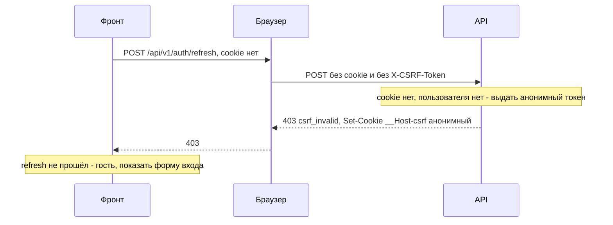

*Проверено на проде 07.10.2026 в Chrome.*

## Регистрация

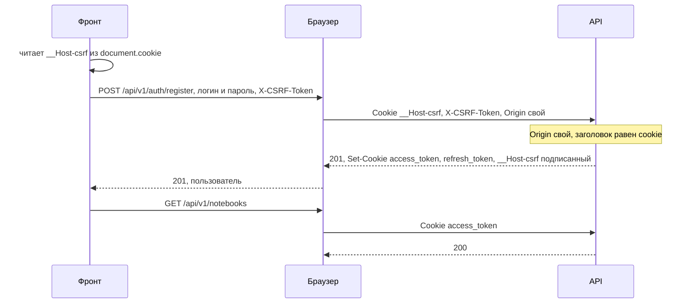

*Проверено на проде 07.10.2026 в Chrome.*

## Вход

Так же, как регистрация: Double Submit без подписи (пользователя ещё нет), в ответе — новые
cookie и подписанный токен. Токен, выданный до входа, после входа не действует.

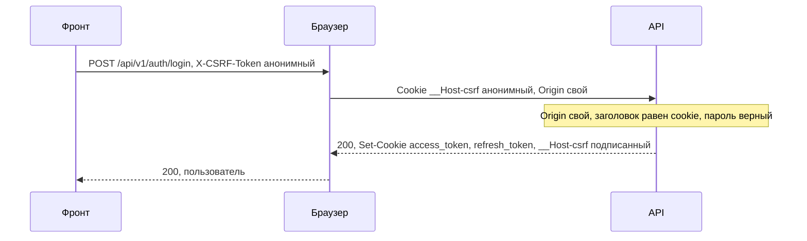

*Проверено на проде 07.10.2026 в Chrome и curl.*

## Вход с неверным паролем

CSRF-проверка пройдена, отказывает обработчик: `401`, cookie не меняются.

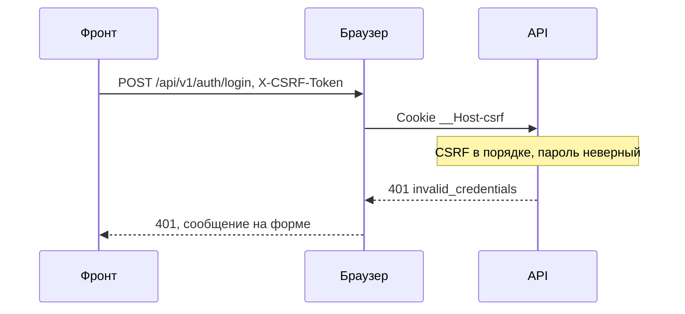

*Проверено на проде 07.10.2026 curl.*

## Перезагрузка страницы со входом

После F5 память фронта пуста, cookie остались. Refresh проверяет подпись токена для владельца
refresh-сессии и выдаёт новую сессию.

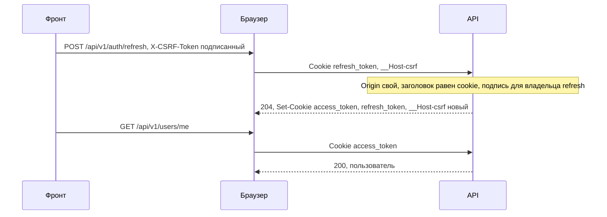

*Проверено на проде 07.10.2026 в Chrome.*

## Изменяющий запрос

Создание блокнота, добавление и удаление ячеек. Токен тот же, что выдан при входе или последнем
refresh: обычные запросы его не меняют.

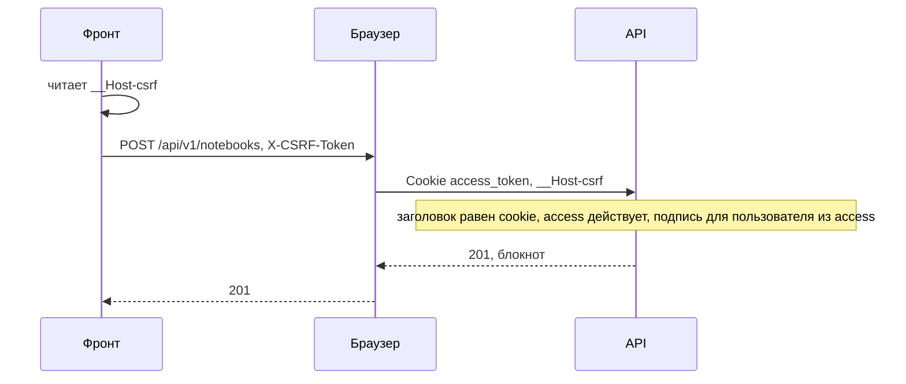

*Проверено на проде 07.10.2026 в Chrome.*

## Выход и повторный вход без перезагрузки

Выход стирает access и refresh и ставит новый анонимный токен. Фронт читает cookie перед каждым
запросом, поэтому следующий вход сразу идёт с новым значением.

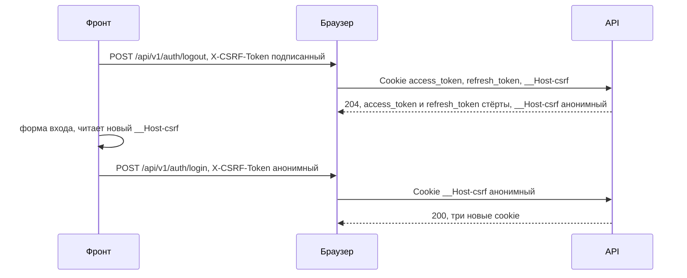

*Проверено на проде 07.10.2026 в Chrome.*

## Чужой компьютер

Алиса вышла, Боб вошёл на том же компьютере. Токен Алисы, сохранённый заранее, у Боба не
проходит: подпись привязана к пользователю.

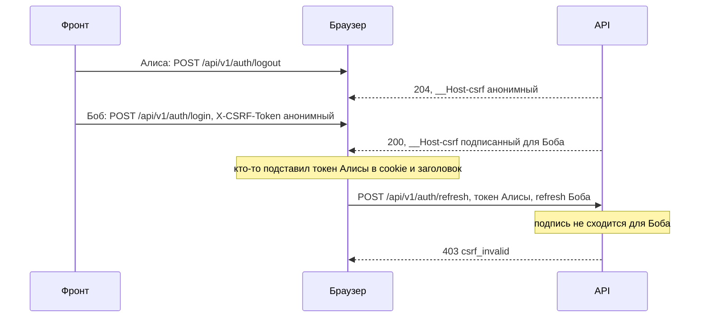

*Проверено на проде 07.10.2026 curl (два пользователя).*

## Истёк access посреди работы

Через 15 минут браузер сам удаляет `access_token`. Запрос получает `401`, фронт делает один
refresh и повторяет запрос со свежим заголовком.

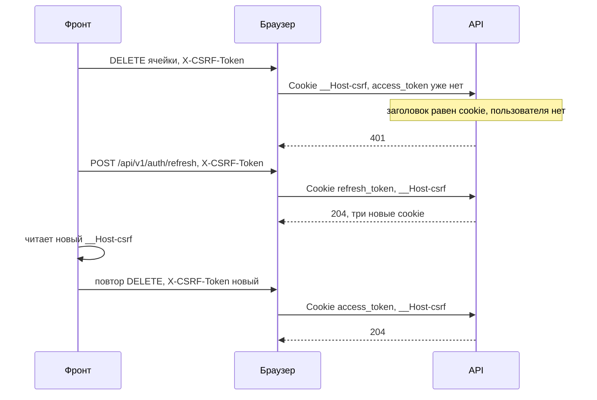

*Только по коду: `authMiddleware` фронта и `CSRF` бэка.*

## Атака с чужого сайта

Страница на `evil.example` отправляет форму на наш API. Форма не может поставить заголовок
`X-CSRF-Token`, а `fetch` с ним вызывает preflight, который CORS для чужого `Origin` не
пропускает. С `SameSite=Lax` браузер и не приложит наши cookie к межсайтовому `POST`, но защита
на это не рассчитывает.

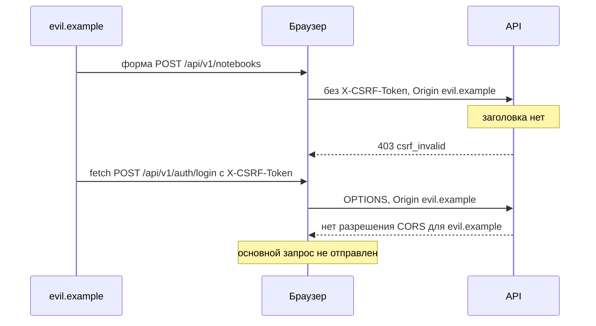

*Проверено на проде 07.10.2026 curl: `POST /auth/register` с `Origin: https://evil.example` —
`403`. Поведение браузера с формой и preflight — по спецификации Fetch.*

## Токен другого пользователя

Даже если злоумышленник подставит свой подписанный токен и в cookie, и в заголовок запроса
жертвы, подпись не сойдётся для её `userID`.

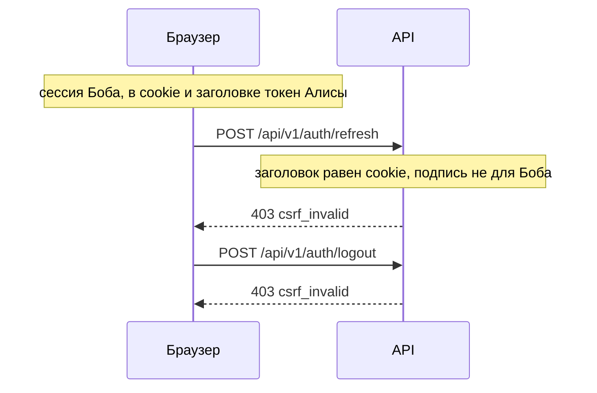

*Проверено на проде 07.10.2026 curl.*

## Вход без `__Host-csrf`

Cookie удалили в другой вкладке или в DevTools. Вход получает `403`, но ответ уже принёс новую
cookie, и фронт один раз повторяет запрос.

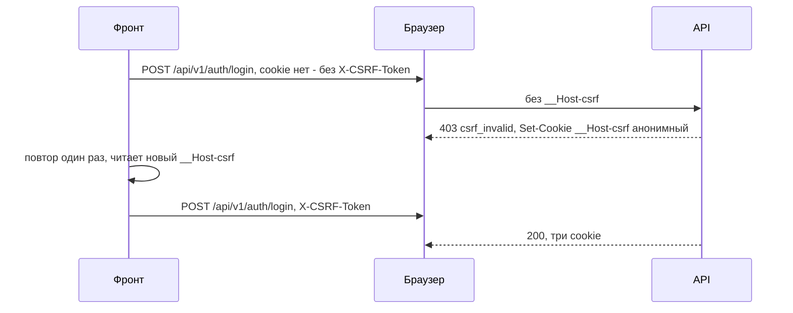

*Проверено на проде 07.10.2026 в Chrome.*

## Сессия есть, `__Host-csrf` нет

Пользователь вошёл, но cookie удалили (или он вошёл до выкатки CSRF-защиты). Бэк в ответе `403`
сразу выдаёт подписанный токен, но фронт повторяет только вход и регистрацию: стартовая проверка
уводит на страницу входа, выход и изменения показывают ошибку. Перезагрузка или повтор действия
проходит. Задача — [frontend#34](https://github.com/Cringe-Driven-Development-Team/frontend/issues/34).

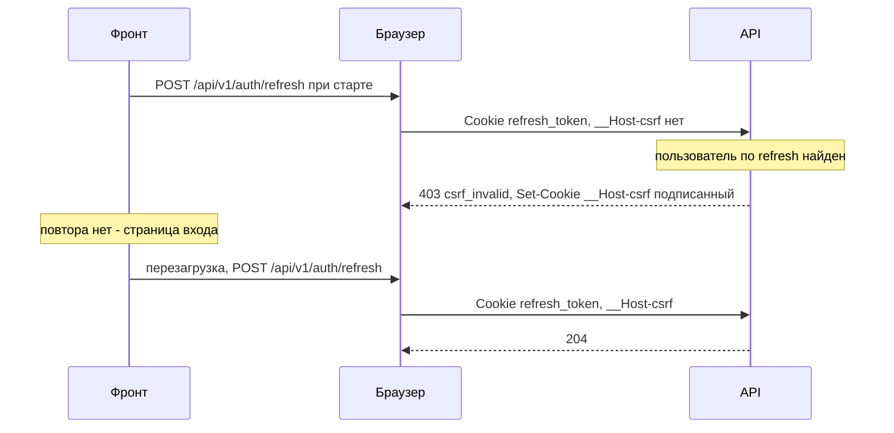

*Проверено на проде 07.10.2026 в Chrome.*

## Две вкладки обновляют сессию одновременно

Refresh удаляет старую сессию, поэтому из двух одновременных refresh с одной cookie проходит
только первый. Вторая вкладка показывает вход, хотя cookie уже обновлены. Бывает после
перезапуска браузера с несколькими вкладками или когда access истёк во всех вкладках сразу.
Задача — [backend#12](https://github.com/Cringe-Driven-Development-Team/backend/issues/12).

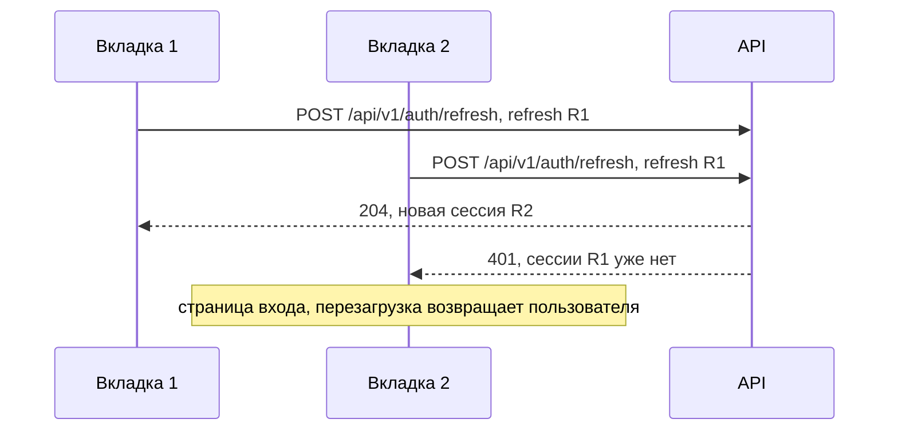

*Проверено на проде 07.10.2026 curl: два параллельных refresh — `204` и `401`.*

## `http://` вместо `https://`

`__Host-csrf` требует `Secure` и по `http://` не сохранится. Сайт отвечает `308` и переводит на
`https://`, поэтому до API по `http://` браузер не доходит.

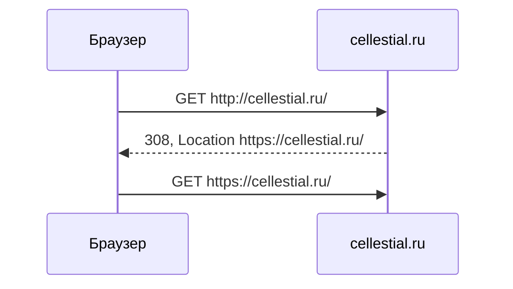

*Проверено на проде 07.10.2026 curl.*
